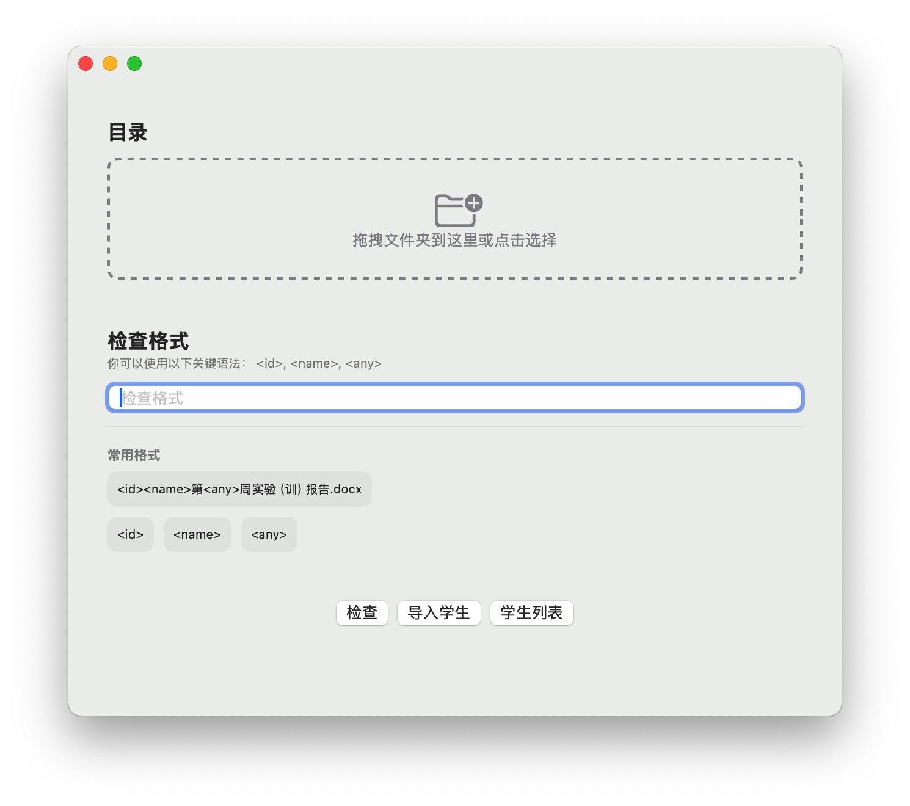

  

    
  

	<h1 align="center"><b>WorkNumMan</b></h1>
	

		Check WorkNum of Students
     
     
    <b>Download for </b>
		<a href="https://github.com/wibus-wee/WorkNumMan/archive/refs/heads/main.zip">Source Code</a>
     
  

## ✨ Features

- [x] Check WorkNum of Students
- [x] Import Students from String List
- [x] Export Result as Image

## ❓ Issues

- [ ] CPU Usage is too high while scrolling.

## 🎨 Preview

## 📄 License

This project is licensed under AGPLv3. See the [LICENSE](LICENSE) file for details.

## 📝 Author

WorkNumMan © Wibus, Released under AGPLv3. Created on Nov 9, 2024

> [Personal Website](http://wibus.ren/) · [Blog](https://blog.wibus.ren/) · GitHub [@wibus-wee](https://github.com/wibus-wee/) · Telegram [@wibus✪](https://t.me/wibus_wee)
